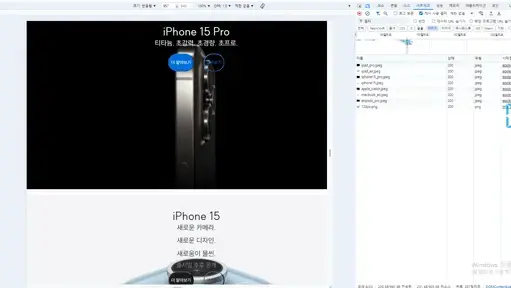
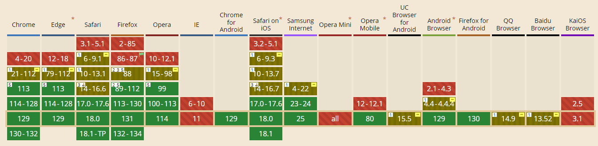

# 4주차 과제 - apple 제품 카드

그리드를 사용하여 구현하고 구현 결과를 움직이는 이미지로 생성하여 삽입해주세요.

## apple 과제 링크

[apple.html](https://hunzooyun.github.io/homework/apple/apple.html)

## 과제에 대하여

과제를 받고 나서 들은 생각은 이번주에 연습했던 그리드를 어떻게하면 잘 써볼수 있을까 생각이 들었습니다.  
보여주신 과제 결과 영상을 보면서 카드를 2가지 종류로 나눠서 버튼과 제목 색깔을 바꿔야 된다는 걸 보고 2가지를 각각 제작하였습니다.  
다른것은 중간 이미지와 설명만 교체하면 되어서 첫번째인 아이패드 프로로 먼저 제작을 해보고 나머지를 복사하였습니다.  
wwdc24 사진은 어디다 쓰는지 모르겠어서 사용을 안하였습니다.

## 하면서 제일 어려웠던 부분

제일 어려웠던 건 배경을 밀도에 따라 1x, 2x로 변환하는거였던거 같습니다.  
수업시간에 배웠던 건 html에서 변경하는거였지만 이번 과제는 배경에서 교체를 해야되다 보니 어떻게 할지 막막해서 검색을 해보았지만 잘 생각이 나지 않아서 이대로 제출할까 싶어서 md문서를 작성하게 되었습니다.  
md문서를 작성하면서 들은 생각은 mdn을 제대로 안 찾아보았다는게 기억나서 imageset에 대한 mdn문서를 찾았고 그 해결법을 알았습니다.  
<https://cloudfour.com/thinks/responsive-images-101-part-8-css-images/>

이후에 md문서 작성하던걸 중단하고 다시 파일을 수정하여 시행결과를 보고 이게 제가 만든게 맞는건가 싶은 생각이 들었습니다.

## 마무리

이번 과제를 하면서 제가 조금만 찾아보고 안된다고 생각을 가지고 있다는 걸 깨달았습니다. 앞으로는 더욱 열심히 찾아보고 다방면으로 검색을 해보도록 노력하겠습니다.
